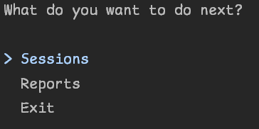
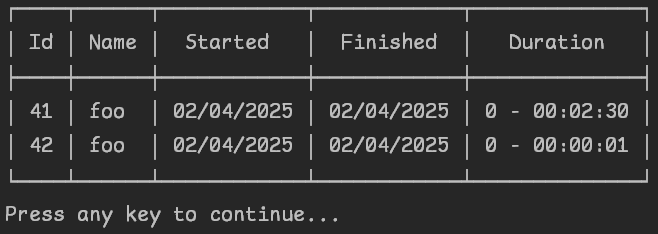
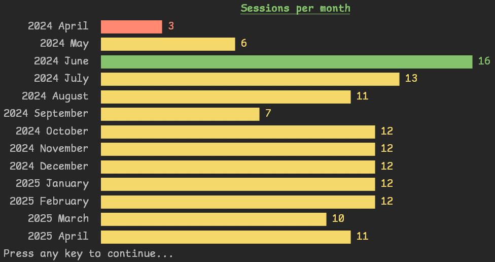

# TCSA.OOP.CodingTracker

A console based C# application used to track time spent coding. Developed using SQLite and Spectre.Console, 
with Bogus for data generation. Implemented using a CRUD and MVC based methodologies.

# How to Use

## Interactive

Call with no parameters and use the arrow buttons and return to navigate:



You will then be presented with various different submenus that then allow you to work with sessions or reports.






## Command Line

Print help information:

```pwsh
CodingTracker.exe --help
```

List all coding sessions:

```pwsh
CodingTracker.exe Session List
```

Create a new coding session:

```pwsh
CodingTracker.exe Session New <sessionName>
```

Create a new coding session with a specific start time:

```pwsh
CodingTracker.exe Session New <sessionName> -s <startDate>
```

Create a new coding session with a specific start and finish time:

```pwsh
CodingTracker.exe Session New <sessionName> -s <startDate> -f <finishDate>
```

Generate sample data:

```pwsh
CodingTracker.exe Utils GenerateSampleData
```

Clear the database:

```pwsh
CodingTracker.exe Utils ClearSessions 
```

# Requirements

- [X] Application should create a sqlite database if one isn't present.
- [X] It should create a table in the database where sessions will be logged.
- [X] Users should be able to insert, delete, update, and view their logged sessions.
- [X] The user should use a specific format for date/time and not allow any other format.
- [X] Create a configuration file to contain database path and connection strings.
- [X] User cannot input the duration of the session this will be calculated based on the start and end times.
- [X] User should be able to input the start and end times manually.
- [X] Use Dapper ORM for data access.
- [X] When reading from database anonymous objects are not allowed.

## Stretch Goals

- [ ] Allow tracking of coding time using a stopwatch.
- [ ] Allow filtering of coding records per period.
- [ ] Allow ordering of records in ascending or descending order.
- [ ] Create reports where users can see their total and average coding session per period.
- [ ] Create the ability to set coding goals and how far the user is from reaching their goal.
- [X] Create demo data.

# Features

- Backed by a database to log all coding sessions
  - SQLite
  - If a fresh instance the correct tables will be created automatically
- Interactive menu if run with no arguments
- Command line interface if correct arguments supplied
  - Run with --help to print help information
  - Option to bulk erase data in command line
  - Option to generate test data in command line
- Validation of date format
- Reporting functionality

# Challenges

I had a few challenges when implementing this project. Some of these were more expected than others.  
The first place that I fell down was overengineering the product from the off. I had visions of doing coding sessions 
for individual projects, with different settings and things like that. I wound up getting half-way through the project
before I started getting weighed down by extra complexity that I just didn't need.  
I wound up creating a new branch, salvaged the bits I actually needed and then starting from basics. Once I had done
this I wound up making a lot more progress a lot swifter.  
I'm still a little disappointed that I wasn't able to ride the wave of enthusiasm through to implementing all of the
features I had thought of, but I'm glad that I have achieved all of the requirements, some of the stretch goals, and
a couple of small personal stretches that took my interest along the way.  

The other major challenge that I faced was timezones and daylight savings here in the UK. I actually changed timezone
halfway through the project and this exposed a bug in the way I handled time that I thought I had accounted for.
fact I had actually tried changing the local timezone of my machine, but this was not enough to trigger the issue.
Right from the start I had inserted data into the database using UTC, however on reading from the database I was forcing
the DateTime Kind to UTC, where actually I wanted to convert it into a UTC DateTime. It was a subtle difference that I 
didn't appreciate at the time.  
I've come across similar things at work and I had deliberately changed my local timezone during the work, but apparently 
not enough to trigger the bug!

Finally, I'm doing most of these projects after work. There are a mix of problems that come with that. Being tired, lack
of motivation, coming back to a project after time off (e.g. life getting in the way). All of these can be overcome to a
degree. I think I need to get better at leaving myself notes for later, effectively giving myself a hand-over.

# Lessons Learned

- Be super careful with DateTime!
- Get your requirements in order before trying to push the boundaries
- Spectre.Console and the CLI variant are real useful
  - Some slight challenges getting my head around some aspects of it
  - I hope to use these a lot more in the future!
- Dapper was a really useful tool for generating data to play with
- Rider has some pretty useful tools for working with databases!

# Areas to Improve

- The MVC pattern is something I want to play with more. I get the idea, but probably need more practice actually 
implementing it in different scenarios
- Rein myself in a bit more at the start of a project. When given one of these sorts of projects I tend to see a number 
of different paths that the project could take me down and often get a bit carried away
- Planning could have gone better. I did come up with a plan but it was pushing things too far from the off
  - More emphasis on class structure, and less emphasis on specific features
- I just need to practice more with SQL in general
  - I'm picking up CS50-SQL soon though!

# Resources Used

- StackOverflow
- Dapper Docs
- Spectre.Console docs
- MS docs for ConfigurationManager
- MS docs on working with SQLite
- SQLite docs
